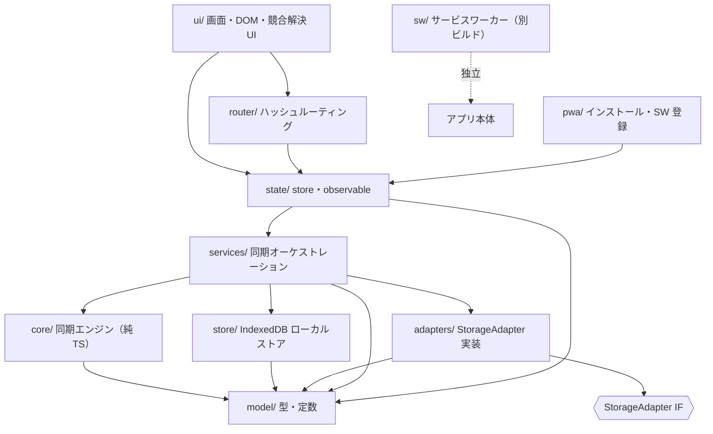
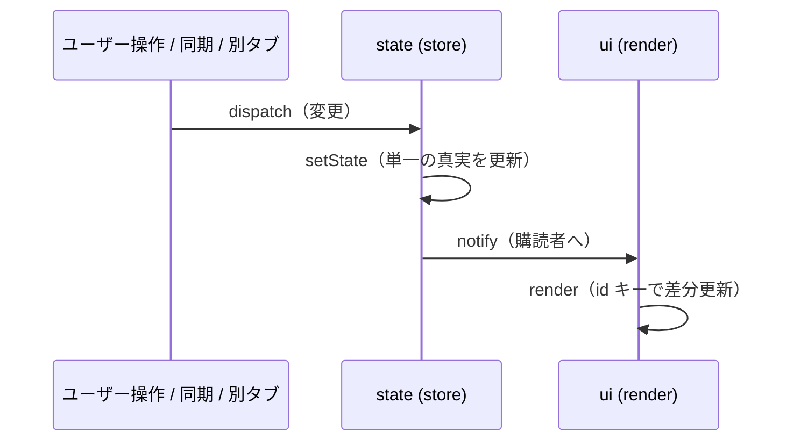

# 01. アーキテクチャ

> 要件トレース: requirements.md「作業の進め方」「技術スタック」「UI / DOM 更新の方針」「同期エンジン仕様」「ローカルストア」
> 状態: ドラフト ／ 実装フェーズ: 全体

## 1.1 絶対原則：依存方向

**`core/`（同期エンジン）は外側を一切知らない。** DOM・`fetch`・IndexedDB・`idb`・各アダプタ・状態管理に依存しない。
入力も出力もプレーンなデータ（`Uint8Array` と純粋な型）だけ。副作用も I/O も持たない。

この原則ひとつで以下が同時に成立する。

- 同期エンジンを UI なしに Vitest で決定的にテストできる（要件「作業の進め方」・[16](./16-testing.md)）。
- 正しさの検証範囲が `core/` に閉じ、保守者がそこだけ精読すればよい（要件「作業の進め方」）。
- I/O（ネットワーク・永続化）の差し替え（InMemory→Dropbox→Drive）が core に波及しない。

## 1.2 レイヤと依存図

要点:

- 依存は基本的に **上 → 下**（UI → state → services → {core, store, adapters} → model）。
- `core` と `model` が最下層。`model` は型と定数のみ（実行時依存ゼロ）。
- `sw/`（サービスワーカー）はアプリ内部モジュールに依存せず、別ビルド成果物として独立（→ [12](./12-pwa-sw-csp.md)）。
- 競合解決などの UI は core を**直接呼ばない**。必ず `services/` 経由でマージコミットを生成する。

## 1.3 レイヤ規約表

| レイヤ | 依存してよい先 | 依存してはいけない先 | 性質 |
|---|---|---|---|
| `model/` | （なし） | すべて | 型・定数のみ |
| `core/` | `model/` | DOM, `idb`, `fetch`, `adapters`, `store`, `state`, `services`, `ui` | 純粋（副作用・I/O なし） |
| `adapters/` | `model/`, `fetch`/OAuth | `core`, `store`, `state`, `ui` | I/O 集約（list/get/put/delete） |
| `store/` | `model/`, `idb` | `core`, `adapters`, `state`, `ui` | ローカル永続 I/O |
| `services/` | `core`, `store`, `adapters`, `model` | `ui`, DOM | オーケストレーション |
| `state/` | `services`, `model` | DOM の直接操作 | 状態保持・pub/sub |
| `ui/` | `state`, `router`, `model` | `core`/`adapters`/`store` を直接呼ぶこと | DOM 副作用 |
| `router/` | `state`, `model` | DOM 以外の I/O | URL ハッシュ ⇄ state |
| `pwa/` | `state`（最小） | core/adapters/store | ブラウザ統合 |
| `sw/` | （独立。`fetch`/Cache API のみ） | アプリ内部モジュール | 別ビルド |

**読み解き方**: 「ある層が core を呼びたくなったら、それは `services/` の仕事」。UI/state は「何を同期したいか」を services に伝え、services が core と I/O を編成する。

## 1.4 データフロー（単一経路）

ユーザー操作・同期マージ・別タブ更新（BroadcastChannel）は、すべて `state/` の `setState → render` 単一経路に合流する（要件「UI / DOM 更新の方針」・[07](./07-state-and-dom.md)）。

## 1.5 依存逆流の機械的検出

レイヤ規約表は文章にとどめず、**CI で機械的に強制**する（→ [15](./15-build-deploy-ci.md)）。

- ESLint（`eslint-plugin-import` の `no-restricted-paths` 等）で「`core/` から `adapters|store|state|ui|services` を import 禁止」「`ui/` から `core|adapters|store` を import 禁止」を規則化。
- 違反は CI（PR の必須チェック）で落とす。これにより「core は外を知らない」が口約束でなく検査対象になる。

## 1.6 関連する不変条件

- 受け入れ基準「正しさが原子的 CAS に非依存」「読み込み時に再ハッシュ検証」は core の純粋性に支えられる（→ [04](./04-sync-engine.md)）。
- 受け入れ基準「すべての読み書きがオフラインで動作」は「UI/state は store（ローカル）だけを読む。adapters（リモート）は services の同期処理からのみ触る」という依存方向から導かれる。
