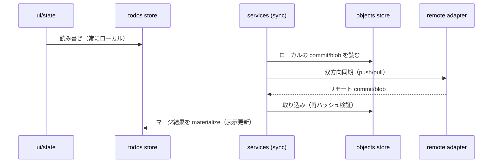

# 06. ローカルストア（IndexedDB）

> 要件トレース: requirements.md「対応プラットフォームと制約」「ローカルストア」「受け入れ基準」
> 状態: 一部実装済（Phase 0：todos/settings/meta） ／ 実装フェーズ: 0（todos）→ 2（objects・BroadcastChannel）

`idb` で IndexedDB を扱う。アプリは**常にローカルを読み書き**し、同期処理（[11](./11-sync-triggers.md)）がローカルのオブジェクトをリモートと双方向にやり取りする（要件「ローカルストア」）。

## 6.1 オブジェクトストア

| store | keyPath | index | 内容 | フェーズ |
|---|---|---|---|---|
| `todos` | `id` | `updatedAt`, `dueDate` | materialize 済み TODO リスト（表示の正）。`deleted` は boolean ゆえ IndexedDB の index に使えない＝索引化せず、表示フィルタは `selectors`（メモリ）で行う | 0 |
| `objects` | `hash` | `kind` | commit / blob のローカル複製 | 2 |
| `meta` | `key` | — | advisory HEAD・lastSyncAt・deviceId | 0/2 |
| `settings` | `key` | — | 端末ごと設定（同期しない / 要件「同期の設定・タイミング」） | 0 |
| `tokens` | `provider` | — | OAuth トークン（防御境界でない前提 / 要件「セキュリティ」） | 2 |

- DB 名・バージョンは `model/constants.ts`。スキーマ変更は `store/db.ts` の `upgrade` で管理。
- **Phase 0** は `todos`/`settings`/`meta`(deviceId) のみで「ローカル専用アプリ」が成立。`objects`/`tokens` は同期導入（Phase 2）で追加。

## 6.2 materialize とオブジェクトストアの関係



- `todos`（表示の正）は `objects` から計算した結果のキャッシュ。Phase 1 のエンジンが出した `mergedSnapshot` を `todos` へ反映する。
- 表示は常に `todos` を読むため、同期の遅延や失敗が UI の読み書きを止めない（受け入れ基準「オフラインで動作」）。

## 6.3 タブ間同期（BroadcastChannel）

同一端末の複数タブは `BroadcastChannel('todo-sync')` で即時同期（要件「ローカルストア」）。受信は `state/` の単一経路（[07](./07-state-and-dom.md)）へ流す。

メッセージ型（最小）:

```ts
type TabMessage =
  | { type: 'todos-changed' }     // todos store が変わった → 再 materialize
  | { type: 'status' }            // 同期ステータスが変わった
  | { type: 'conflicts' };        // 競合集合が変わった
```

> 設計判断: ペイロードは載せず「変わった」通知のみにし、受信側が IndexedDB から読み直す。タブ間でのデータ二重管理を避け、IndexedDB を単一の真実に保つ。

## 6.4 iOS とローカル消失からの復旧

iOS ではローカルストレージが消え得る（要件「対応プラットフォームと制約」）。正本はリモートにあるため、**起動／前面復帰時にリモートから再同期**して復旧する（受け入れ基準）。

- 起動時に `objects` が空でも、`heads/` 列挙 → コミット取得 → materialize で表示を再構築できる。
- `heads/` 起点でロードするため、他端末が未 publish の孤立先端は即座には見えないが、各端末は自分のローカル複製から再 publish して回収する（[04 §4.6](./04-sync-engine.md) の回復モデルと一貫）。
- このフローは [11](./11-sync-triggers.md)（トリガ④オンライン復帰・前面復帰）と [12](./12-pwa-sw-csp.md)（iOS 制約）に接続する。

## 6.5 関連する不変条件

- アプリの読み書きはローカル（`todos`）に閉じる＝オフライン動作（受け入れ基準）。
- 設定は `settings` store にのみ存在し `objects`/`todos` に混ざらない＝同期データに載らない（受け入れ基準）。
- リモートから取り込む全 blob は `objects` 格納前に再ハッシュ検証（[04 §4.2](./04-sync-engine.md)・受け入れ基準）。
