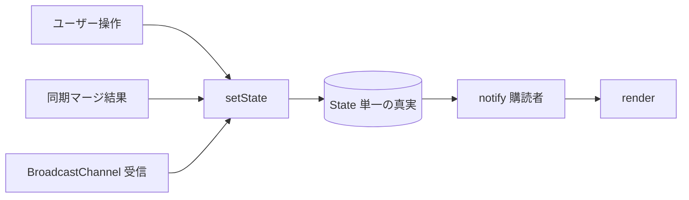

# 07. 状態管理と DOM 更新

> 要件トレース: requirements.md「UI / DOM 更新の方針」「受け入れ基準」
> 状態: ドラフト ／ 実装フェーズ: 0

バニラ TS を保守可能に保つための規約。フレームワークを使わない代わりに、**状態の単一経路**と**id キー差分更新**を自前で用意する。

## 7.1 単一の真実と setState→render 一本道

- 状態の真実（materialize 済み TODO リスト等）を `state/store.ts` の 1 か所に持つ（[03 §3.7](./03-data-model.md) の `State`）。
- 更新は必ず `setState → render` の一本道。ユーザー操作・同期マージ・別タブ更新（BroadcastChannel）を**すべてこの単一経路に流す**（要件「UI / DOM 更新の方針」）。
- 軽量な observable / pub-sub を自前で用意する。

```
store.getState(): State
store.setState(patch): void        // 部分更新 → 購読者へ notify
store.subscribe(listener): unsub    // render などが購読
```



## 7.2 id キー差分更新（keyed reconciliation）

リスト描画は**全消し再生成をしない**。TODO の `id` をキーに DOM ノードを `Map<Uuid, HTMLElement>` で管理し、差分のみ反映する（要件「UI / DOM 更新の方針」）。これにより古いノード残留・編集中フォーカス/スクロール喪失・ちらつきを防ぐ（受け入れ基準）。

```
renderList(container, nextTodos, nodeMap):
  nextIds = nextTodos.map(t => t.id)
  // 1) 削除: 新リストに無いノードを remove
  for [id, node] in nodeMap: if id ∉ nextIds: node.remove(); nodeMap.delete(id)
  // 2) 追加/更新 + 並び順
  prev = null
  for t in nextTodos:
    node = nodeMap.get(t.id) ?? cloneTemplate('todo-item')   // 無ければ <template> クローン
    updateNode(node, t)                                      // 変わった属性/テキストのみ更新
    if node is not directly after prev: container.insertBefore(node, prev?.nextSibling ?? container.firstChild)
    nodeMap.set(t.id, node); prev = node
```

> 不変条件: 既存ノードは**再生成せず属性のみ更新**するため、入力中のフォーカス・キャレット・スクロール位置が保たれる（受け入れ基準）。`updateNode` は値が変わったフィールドだけ DOM に触る。

## 7.3 DOM 生成の規約

- DOM は文字列連結でなく **`<template>` クローン**で生成（`ui/templates/`）。
- ユーザー由来テキストは **`textContent`** で挿入。**`innerHTML` は使わない**（要件「UI / DOM 更新の方針」・受け入れ基準・[14](./14-security.md)）。
- ヘルパは `ui/dom.ts` に集約（`cloneTemplate(id)`, `setText(node, sel, text)`, `renderList(...)` 等）。

## 7.4 派生値（selectors）

`state/selectors.ts` で `State` から派生を計算する（再計算は単純・メモ化は必要時のみ）。

- 表示順ソート済み TODO（v1 は期日／作成順 / 要件「データモデル」）。
- 競合件数（ナビのバッジ源 / [09](./09-status.md)）。
- 全体同期ステータスの導出材料。

## 7.5 関連する不変条件

- すべての状態更新が単一経路を通る＝同期マージや別タブ更新も UI 操作と同じ流れ（要件「UI / DOM 更新の方針」）。
- リスト変更は id キー差分更新でフォーカス／スクロール維持（受け入れ基準）。
- `innerHTML` 不使用・`textContent` 挿入（受け入れ基準・[14](./14-security.md)）。
