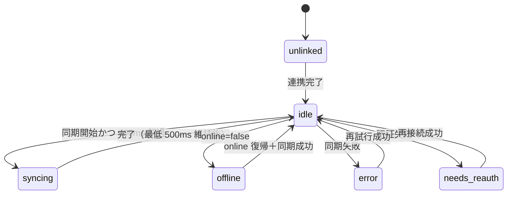

# 09. ステータス表示

> 要件トレース: requirements.md「画面構成とナビゲーション」「競合の表示と解決」「ステータス表示」「受け入れ基準」
> 状態: ドラフト ／ 実装フェーズ: 2

## 9.1 未連携と連携済みの二分

- **未連携（保存先未設定）**: 同期系の表示を**一切出さない**。ただのローカル TODO アプリとして振る舞う（要件「ステータス表示」, 受け入れ基準）。連携導線は設定に置き、必要なら初回だけ控えめで消せる案内のみ。
- **連携済み**: 以下の全体／個別／バッジを出す。

`State.global === 'unlinked'` のとき UI 層はステータス・バッジを描画しない、を不変条件にする。

## 9.2 全体ステータス（ヘッダ隅）

全画面のヘッダ隅に小さく。普段は静かで必要時のみ主張（要件「ステータス表示」）。状態機械:



表示文言: 同期中 / オフライン / 最終同期 HH:MM / エラー / 要再接続（要件「ステータス表示」）。

### ちらつき対策（数値で固定）

要件「ステータス表示」 を具体化する。

- `syncing` は同期開始から **400ms を超えたときだけ**点灯する。
- 点灯したら **最低 500ms 維持**する。
- 400ms 未満で終わる同期では `syncing` を出さず、`lastSyncAt`（最終同期時刻）だけを静かに更新する。

```
onSyncStart():
  showTimer = setTimeout(() => setGlobal('syncing'); shownAt = now(), 400ms)
onSyncEnd():
  clearTimeout(showTimer)
  if global == 'syncing':
    remain = 500ms - (now() - shownAt)
    after max(remain, 0): setGlobal('idle'); setLastSyncAt(now())
  else:
    setLastSyncAt(now())   // 静かに更新（syncing を出さない）
```

## 9.3 TODO 個別ステータス（一覧の各項目）

| 値 | 意味 |
|---|---|
| `synced` | 同期済み |
| `unpushed` | 保存先はあるが未 push |
| `conflict` | 同期できませんでした（＋「同期不具合を解決する」ボタン / [10](./10-conflict-ui.md)） |

個別項目に一時的な「同期中」は出さない（要件「ステータス表示」）。値は `State.perTodoStatus`（[03](./03-data-model.md)）。

## 9.4 編集画面のステータス

開いている項目の同期ステータスを画面上部に表示（要件「ステータス表示」）。値は同じく `perTodoStatus[id]`。

## 9.5 競合 vs 一時エラーの区別

- **競合**（同一フィールド食い違い）: per-todo に「同期できませんでした」＋解決ボタン（競合専用 / 要件「競合の表示と解決」, 要件「競合の表示と解決」）。複数競合すれば複数出てよい。全体バナーは作らない。
- **一時的なネット/認証エラー**: 全体ステータス側（オフライン / エラー / 要再接続）に出す（要件「競合の表示と解決」）。

## 9.6 ナビのバッジ

[08 §8.5](./08-routing-views.md) と同一。競合件数→タスクタブ、reauth/error→設定タブ（要件「画面構成とナビゲーション」, 要件「ステータス表示」）。`state/selectors.ts` が `State.conflicts` / `global` から導出。

## 9.7 関連する不変条件

- 未連携時は同期系 UI を一切出さない（受け入れ基準）。
- 連携済み時のみステータス・バッジが現れる。
- 競合は該当 TODO に表示され、解決まで保持（受け入れ基準・[10](./10-conflict-ui.md)）。
